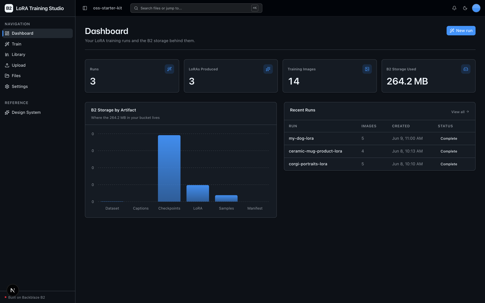
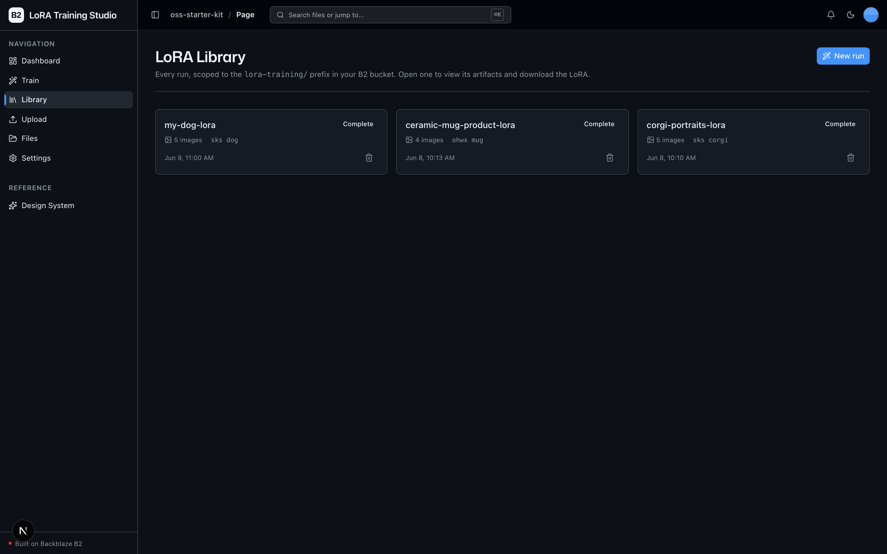
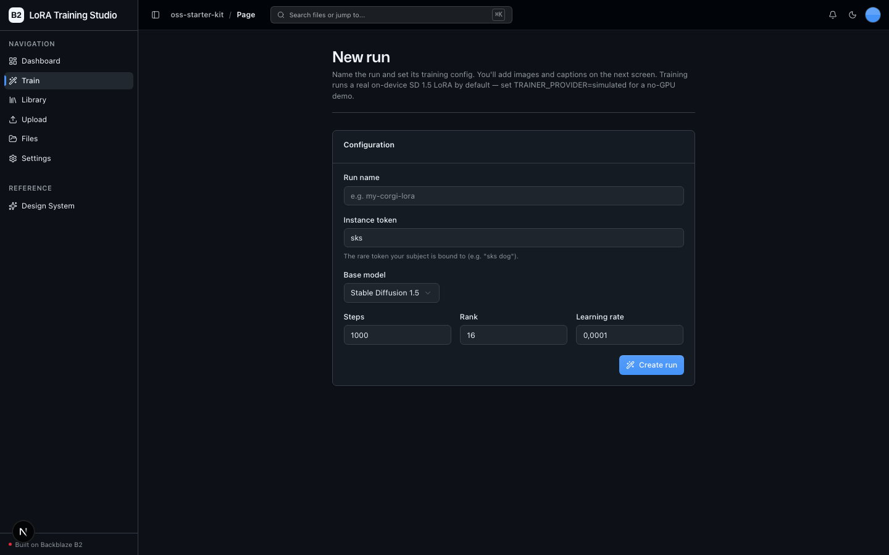
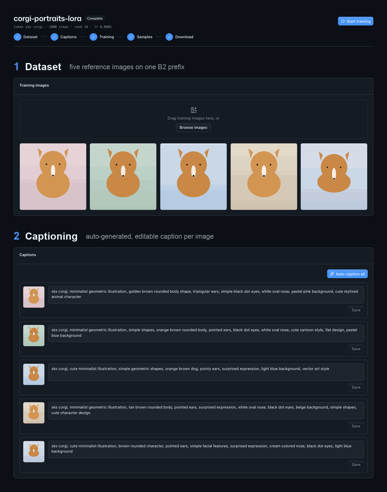
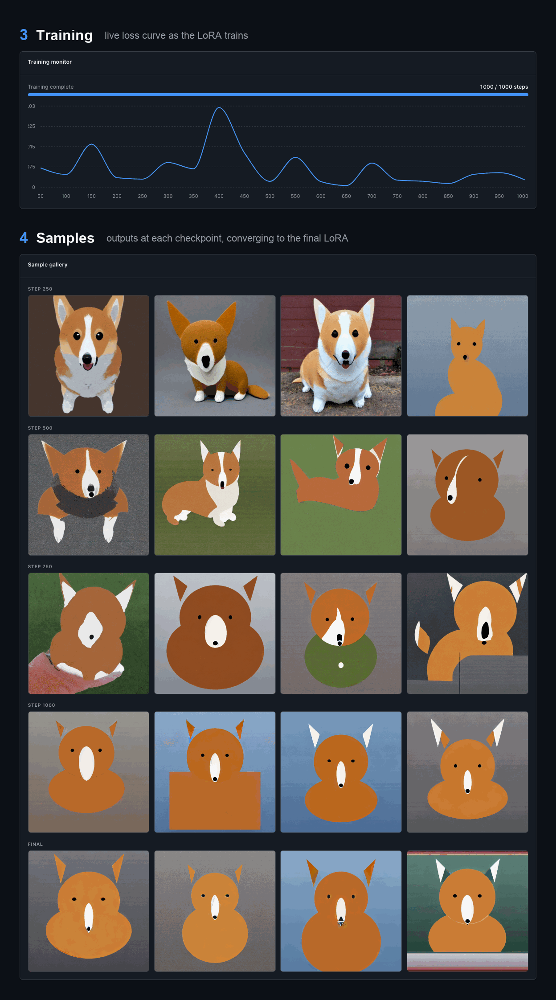

<!-- last_verified: 2026-06-09 -->
# LoRA Training Studio

An end-to-end, browser-based **LoRA fine-tuning workflow** for image models, with every artifact in the lifecycle stored on **[Backblaze B2](https://www.backblaze.com/sign-up/ai-cloud-storage?utm_source=github&utm_medium=referral&utm_campaign=ai_artifacts&utm_content=b2ai-lora-training-studio)**. Upload a handful of training images, caption them, launch a run, watch the loss curve and sample gallery fill in, then download the trained `.safetensors` — the source dataset, per-image captions, intermediate checkpoints, the final LoRA, and every sample image are all written to and read back from B2 over the S3-compatible API, keyed under one prefix per run.

**Training runs a real on-device LoRA fine-tune by default** — `TRAINER_PROVIDER=local` trains a genuine Stable Diffusion 1.5 LoRA with diffusers + peft on your GPU/Apple-Silicon (MPS), writing a real `.safetensors` and real sample images to B2. It needs the ML stack installed (`pip install -r services/api/requirements-local-trainer.txt`) and a GPU/MPS backend. For a zero-config run with **no GPU and no API keys**, set `TRAINER_PROVIDER=simulated`: the simulated trainer emits placeholder checkpoints, a stub `.safetensors`, and Pillow-rendered sample images with a synthetic loss curve. The B2 storage layer is the real, production-shaped part either way. Cloud training (Replicate) and Claude-vision captioning are optional, clearly-marked extension points.

**What you get out of the box:**
- Guided run pipeline: dataset → captions → training → samples → download, tracked as one state machine
- Per-run dataset upload with thumbnails and dimension extraction
- Per-image caption editor + one-click auto-caption (offline by default)
- Live training monitor: step progress, a loss curve, intermediate checkpoints, and a growing sample gallery — all persisted to B2
- A **LoRA Library** scoped to the `lora-training/` prefix, plus the starter kit's full-bucket file explorer
- Storage-lifecycle dashboard: runs, LoRAs produced, training-image count, and a B2 storage breakdown by artifact type

## What it looks like

**Dashboard** — run counts, LoRAs produced, training-image totals, and total B2 usage, with a storage-by-artifact-type breakdown and a recent-runs table.



**LoRA Library** — every run scoped to the `lora-training/` prefix as a card grid, each showing its image count, instance token, status, and creation time.



**Train** — name a run and set its training config (instance token, base model, steps, rank, learning rate) before adding images and captions.



### Inside a run

Open a run to walk its pipeline end to end — the stepper tracks `dataset → captions → training → samples → download`, and every artifact along the way lives on B2 under that run's prefix.

**Dataset & captioning** — upload a handful of reference images to one B2 prefix, then auto-caption each (offline by default) and edit any caption before training.



**Training & samples** — watch the loss curve descend live while a sample gallery fills in at each checkpoint, converging on the final LoRA you download as a `.safetensors`.



## How "versioned on B2" works

Every run, every checkpoint step, and every sample set is retained as a distinct, addressable object under `lora-training/{run_id}/...`. This is **keyed/immutable retention**, not S3 bucket versioning — no bucket-level versioning is enabled and there are **no b2-native API calls**, keeping everything inside the S3-compatible standard.

```
lora-training/{run_id}/
  run.json                               # manifest: status, config, metrics, artifact keys
  dataset/{image_id}.{ext}               # uploaded training images
  captions/{image_id}.txt                # one caption per image
  checkpoints/step-{NNNNNN}.bin          # intermediate checkpoints
  lora/{run_id}.safetensors              # final downloadable LoRA
  samples/step-{NNNNNN}/sample-{NN}.png  # sample gallery per checkpoint step
  samples/final/sample-{NN}.png
```

## Agent-First Architecture

This repo is optimized for coding agents. The structure follows the principle that **repository knowledge is the system of record** — everything an agent needs is versioned, co-located, and discoverable from the repo itself.

**[AGENTS.md](AGENTS.md) is the single source of truth for all coding agents.** Architecture is enforced mechanically: layering rules, import boundaries, file-size limits, and SDK containment are verified by structural tests and lints on every change.

```
AGENTS.md              Single source of truth — layout, invariants, commands, conventions
ARCHITECTURE.md        System layout, layering rules, data flows, the run lifecycle
docs/
  features/            Feature docs (inputs, outputs, flows, edge cases)
  app-workflows.md     User journeys
  dev-workflows.md     Engineering workflows and testing
  SECURITY.md          Security principles
  RELIABILITY.md       Reliability expectations
  exec-plans/          Execution plans and tech debt tracker
```

## Quick Start

You need: Node.js >= 20, pnpm >= 9, Python >= 3.11, and a free **[Backblaze B2 account](https://www.backblaze.com/sign-up/ai-cloud-storage?utm_source=github&utm_medium=referral&utm_campaign=ai_artifacts&utm_content=b2ai-lora-training-studio)**.

```bash
git clone https://github.com/backblaze-b2-samples/lora-training-studio.git
cd lora-training-studio
```

### Setup

**1. Install dependencies**

```bash
pnpm install
```

**2. Set up the backend**

```bash
cd services/api
python -m venv .venv && source .venv/bin/activate
pip install -r requirements.txt
# The default trainer is the real on-device SD 1.5 LoRA — install its ML stack
# (torch/diffusers/peft). Requires a GPU or Apple-Silicon (MPS) backend.
pip install -r requirements-local-trainer.txt
cd ../..
```

> The default `local` trainer downloads the ~4 GB SD 1.5 base on first run and a
> training run takes a few minutes; see [Trainer & Captioner Providers](docs/features/trainer-providers.md)
> for `LOCAL_*` tuning. **No GPU?** Skip the second `pip install` and set
> `TRAINER_PROVIDER=simulated` in `.env` for a zero-dependency run (placeholder
> artifacts + a synthetic loss curve in seconds).

**3. Add your B2 credentials**

```bash
cp .env.example .env
```

Open `.env` in your editor. Then head to the [Backblaze B2 dashboard](https://secure.backblaze.com/b2_buckets.htm?utm_source=github&utm_medium=referral&utm_campaign=ai_artifacts&utm_content=b2ai-lora-training-studio) and:

1. **Create a bucket.** B2 shows these values — paste each into `.env`:
   - **Bucket Unique Name** → `B2_BUCKET_NAME`
   - **Endpoint** → `B2_ENDPOINT`
   - The region segment of the endpoint (e.g. `us-west-004`) → `B2_REGION`
2. **Create an application key** with `Read and Write` permission:
   - **keyID** → `B2_APPLICATION_KEY_ID`
   - **applicationKey** → `B2_APPLICATION_KEY` *(only shown once — paste it now)*

> Want a walkthrough? See the docs for [creating a bucket](https://www.backblaze.com/docs/cloud-storage-create-and-manage-buckets?utm_source=github&utm_medium=referral&utm_campaign=ai_artifacts&utm_content=b2ai-lora-training-studio) and [creating app keys](https://www.backblaze.com/docs/cloud-storage-create-and-manage-app-keys?utm_source=github&utm_medium=referral&utm_campaign=ai_artifacts&utm_content=b2ai-lora-training-studio).

**Optional:**
- **Zero-config simulated training** — set `TRAINER_PROVIDER=simulated` to skip the ML stack and GPU entirely. The simulated trainer emits placeholder checkpoints, a stub `.safetensors`, and Pillow-rendered samples with a synthetic loss curve in a few seconds — same B2 layout as the real trainer. Handy for demos, CI, or no-GPU machines.
- `ANTHROPIC_API_KEY` — enables Claude-vision auto-captioning. Set `CAPTIONER_PROVIDER=claude` to use it (the default captioner is offline/templated).
- `REPLICATE_API_TOKEN` — placeholder for the optional Replicate cloud trainer (extension stub, not wired).

**4. Run it**

```bash
pnpm dev
```

Frontend at `localhost:3000`, API at `localhost:8000`. Create a run from **Train**, add a few images, auto-caption them, start training, and watch the loss curve and sample gallery fill in — then download the LoRA.

`pnpm dev` runs `pnpm doctor` first — a preflight check that catches the common setup gotchas (wrong Node/Python version, missing venv, missing or placeholder `.env`, ports already taken). Run it standalone any time with `pnpm doctor`.

## Core Features

- [LoRA Pipeline](docs/features/lora-pipeline.md) — the end-to-end run state machine
- [Dataset Images](docs/features/dataset-images.md) — per-run image upload, thumbnails, add/remove
- [Captioning](docs/features/captioning.md) — manual editor + optional offline/Claude auto-caption
- [Training](docs/features/training.md) — the trainer adapter, real on-device default + simulated fallback, progress/loss/checkpoints
- [Sample Gallery](docs/features/sample-gallery.md) — sample image generation + presigned viewing
- [LoRA Library](docs/features/lora-library.md) — the scoped explorer, run detail, and download
- [Trainer & Captioner Providers](docs/features/trainer-providers.md) — the adapter pattern (local/simulated/Replicate trainers, templated/Claude captioners)
- [Dashboard](docs/features/dashboard.md) — run metrics + B2 storage breakdown
- [File Browser](docs/features/file-browser.md) — full-bucket explorer (kept from the starter kit)
- [File Upload](docs/features/file-upload.md) — generic drag-and-drop upload surface
- [Metadata Extraction](docs/features/metadata-extraction.md) — image dimensions, EXIF, checksums
- [Design System](docs/design-system.md) — tokens, primitives, error/empty states. Live preview at `/design`.

## Tech Stack

- TypeScript, Next.js 16, React 19, Tailwind v4, shadcn/ui, Recharts
- TanStack Query — caching, dedup, retry, stale-while-revalidate for every fetch
- Python 3.11+, FastAPI, boto3, Pydantic v2, Pillow
- Backblaze B2 (S3-compatible object storage)
- pnpm workspaces (monorepo)

## Commands

| Command | What it does |
|---------|-------------|
| `pnpm dev` | Start frontend + backend |
| `pnpm dev:web` | Frontend only |
| `pnpm dev:api` | Backend only |
| `pnpm build` | Build frontend |
| `pnpm lint` | Lint frontend |
| `pnpm lint:api` | Lint backend (ruff) |
| `pnpm test:api` | Run backend tests |
| `pnpm check:structure` | Verify layering rules |
| `pnpm test:e2e` | Playwright e2e tests (run `pnpm --filter @lora-training-studio/web exec playwright install chromium` once first) |

## Documentation Map

| Doc | Purpose |
|-----|---------|
| [AGENTS.md](AGENTS.md) | Agent table of contents — start here |
| [ARCHITECTURE.md](ARCHITECTURE.md) | System layout, layering, data flows, run lifecycle |
| [docs/features/](docs/features/) | Feature docs |
| [docs/design-system.md](docs/design-system.md) | Design tokens, primitives, error/empty states |
| [docs/app-workflows.md](docs/app-workflows.md) | User journeys |
| [docs/dev-workflows.md](docs/dev-workflows.md) | Engineering workflows and testing |
| [docs/SECURITY.md](docs/SECURITY.md) | Security principles |
| [docs/RELIABILITY.md](docs/RELIABILITY.md) | Reliability expectations |
| [docs/exec-plans/](docs/exec-plans/) | Execution plans and tech debt tracker |

## License

MIT License - see [LICENSE](LICENSE) for details.

## Claude Agent B2 Skill

Manage Backblaze B2 from your terminal using natural language (list/search, audits, stale or large file detection, security checks, safe cleanup).

Repo: [https://github.com/backblaze-b2-samples/claude-skill-b2-cloud-storage](https://github.com/backblaze-b2-samples/claude-skill-b2-cloud-storage)
